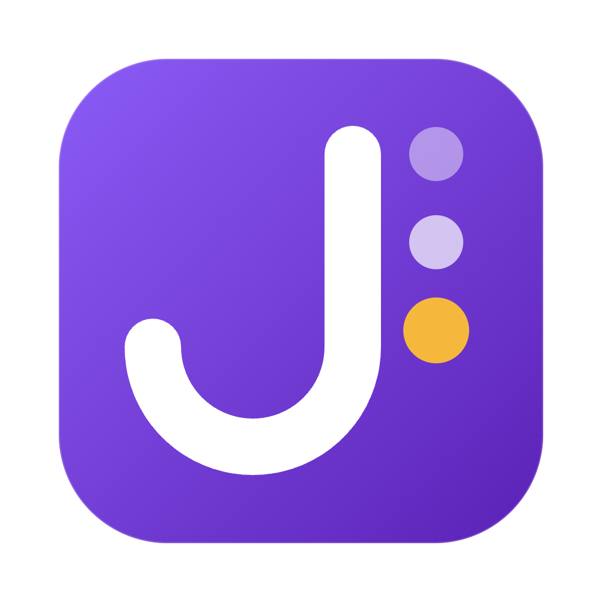

<p align="center">
  
</p>

<h1 align="center">JobTrack</h1>

<p align="center">
  Track every job you apply to with one field.<br>
  Paste a link or type "Company, Role". Follow-ups, history and stats take care of themselves.
</p>

<p align="center">
  Website with accounts · Mac and Windows apps with no account
</p>

<p align="center">
  <a href="https://vercel.com/new/clone?repository-url=https%3A%2F%2Fgithub.com%2Foss-aryanroy%2Fjobtrack&root-directory=apps%2Fweb&project-name=jobtrack&repository-name=jobtrack&products=%5B%7B%22type%22%3A%22integration%22%2C%22protocol%22%3A%22storage%22%2C%22productSlug%22%3A%22neon%22%2C%22integrationSlug%22%3A%22neon%22%7D%5D"></a>
</p>

<p align="center"><sub>Creates a Vercel project with a free Neon Postgres database. Tables are set up on the first build.</sub></p>

## Features

- **Quick add** from a job link or "Company, Role". Greenhouse and Lever links fill in the company, role and location.
- **Automatic follow-ups** after you apply and after interviews, with one-click Done, snooze or "no reply".
- **Board, calendar, interviews and companies** views, plus search and commands with ⌘K / Ctrl+K.
- **Honest numbers**: reply and interview rates show their sample size and say "too few" instead of a misleading percentage.
- **End-to-end encrypted website**: applications are encrypted in your browser with a key derived from your password (Argon2id + AES-GCM). The server, and whoever runs it, only stores ciphertext.
- **Portable data**: export a `.jobtrack` file from any copy (Mac, Windows, website) and import it into any other. CSV import and export too.
- Light and dark mode, undo for every change.

## Run it locally

Requires Node 22+ and pnpm.

```sh
pnpm install
```

**Website** (needs Postgres):

```sh
docker run -d --name jobtrack-pg -e POSTGRES_USER=jobtrack -e POSTGRES_PASSWORD=jobtrack -e POSTGRES_DB=jobtrack -p 54329:5432 postgres:17-alpine
cp apps/web/.env.example apps/web/.env.local
pnpm --filter @jobtrack/web migrate
pnpm --filter @jobtrack/web dev
```

**Desktop app** (needs [Rust](https://rustup.rs) for Tauri):

```sh
pnpm --filter @jobtrack/desktop tauri dev
pnpm --filter @jobtrack/desktop tauri build
```

**Releases:** push a tag like `v0.1.0` (matching the version in `apps/desktop/src-tauri/tauri.conf.json`) and GitHub Actions builds the Mac `.dmg` and Windows installers into a draft release.

**Tests:**

```sh
pnpm test
```

## Project layout

```
packages/core     data model, rules, .jobtrack format (protobuf), tests
packages/ui       the React app shared by web and desktop
apps/web          Next.js website with accounts and Postgres
apps/desktop      Tauri app for Mac and Windows, local storage
```

## License

[GNU AGPL v3.0 or later](LICENSE). If you run a modified version as a public service, you must share your changes under the same license.
